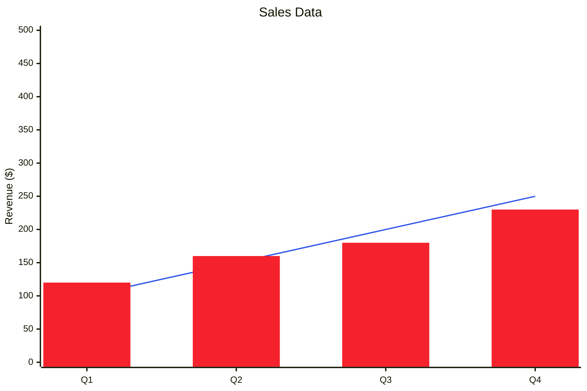

# Chart Generation Guide

This guide covers creating various charts and data visualizations.

## Chart Types

### Bar Chart

Useful for comparing values across categories.

```
Categories: A, B, C, D
Values: 10, 25, 15, 30

Layout:
D: ██████
C: ███
B: █████
A: ██
```

### Line Chart

Useful for showing trends over time.

```
       ╱╲     ╱
      ╱  ╲   ╱
     ╱    ╲╱
    ╱
```

### Pie Chart

Useful for showing proportions or percentages.

```
    30% - Component A
    40% - Component B
    20% - Component C
    10% - Component D
```

## ASCII Chart Example

```
Monthly Revenue Trend

$100k |                    ╱╲
      |                   ╱  ╲
 $80k |       ╱╲         ╱    ╲
      |      ╱  ╲       ╱      ╲
 $60k |     ╱    ╲     ╱        ╲
      |    ╱      ╲   ╱          ╲
 $40k |   ╱        ╲ ╱            ╲
      |  ╱          ╱              ╲╱
 $20k | ╱                           
      |╱_____________________________
      Jan Feb Mar Apr May Jun Jul Aug
```

## Data Visualization Best Practices

1. **Choose the right chart type** for your data:
   - Bar/Column charts: Comparisons
   - Line charts: Trends over time
   - Pie charts: Proportions
   - Scatter plots: Relationships

2. **Label clearly**: Axes, values, and legends

3. **Use color meaningfully**: Highlight important data points

4. **Avoid clutter**: Remove unnecessary elements

5. **Ensure readability**: Font sizes, contrast, aspect ratio

## Mermaid Bar Chart



## Creating Custom Charts

For complex requirements, consider using Python with libraries like:

- `matplotlib` - Static plots
- `plotly` - Interactive visualizations
- `pygal` - SVG charts
- `bokeh` - Interactive web visualizations
