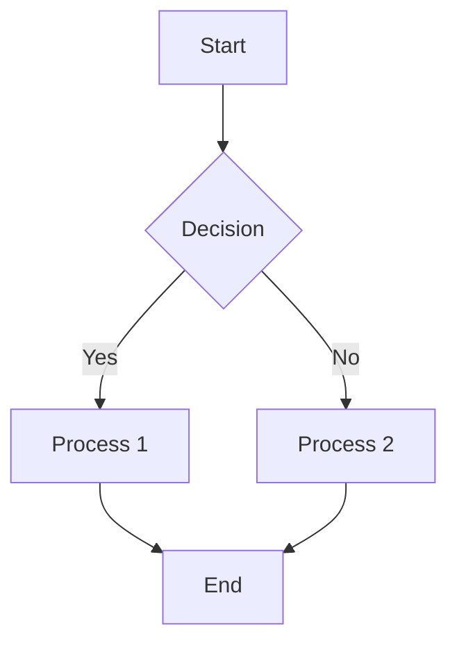
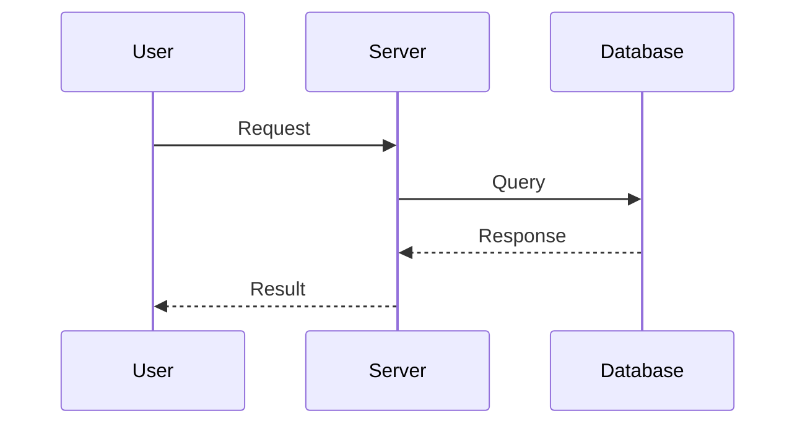
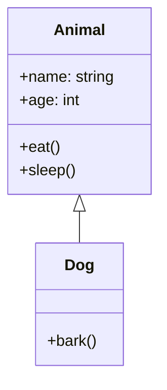
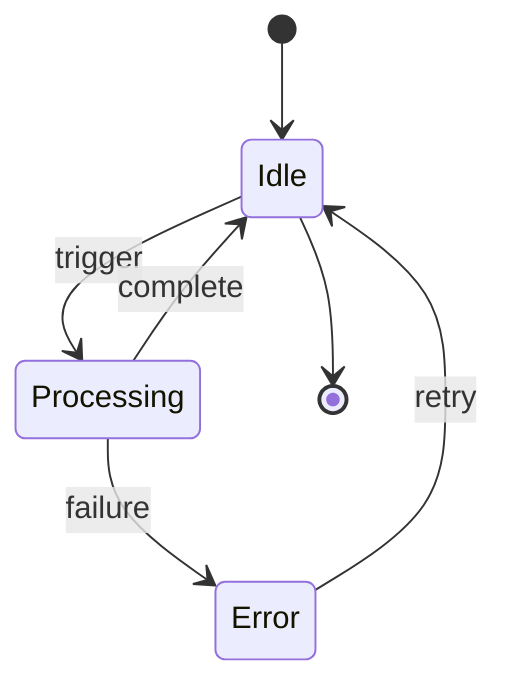
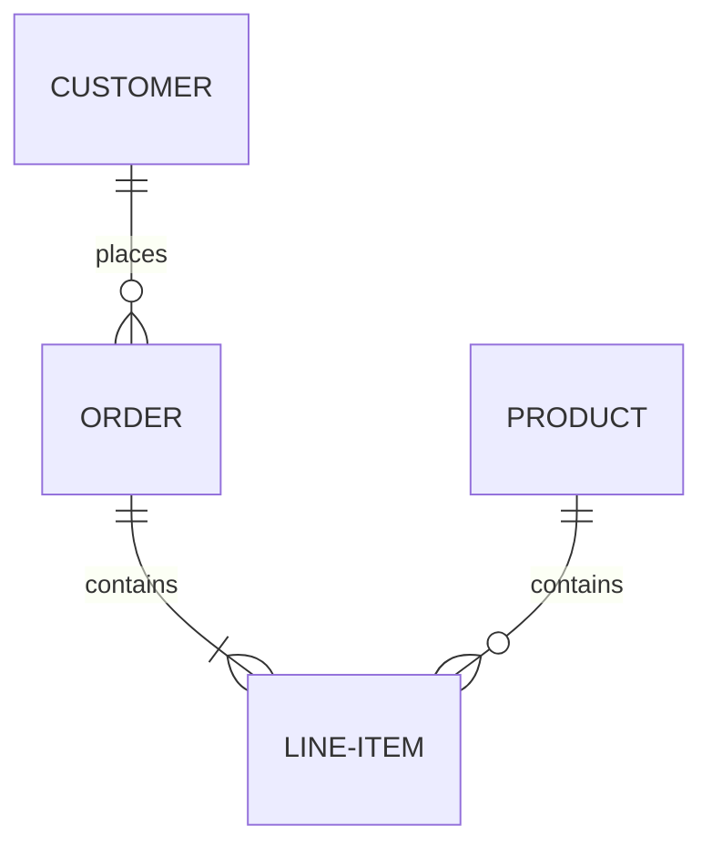
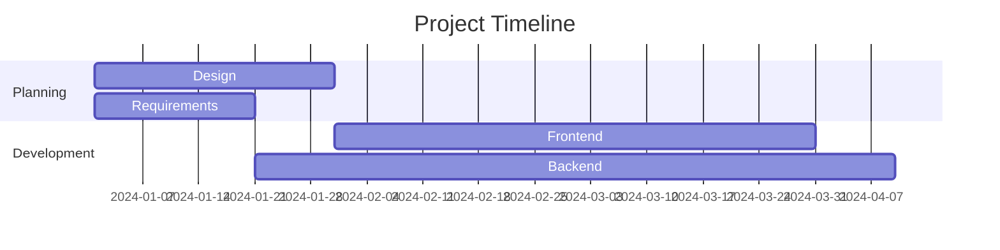
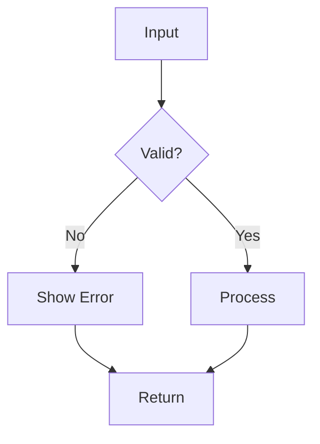
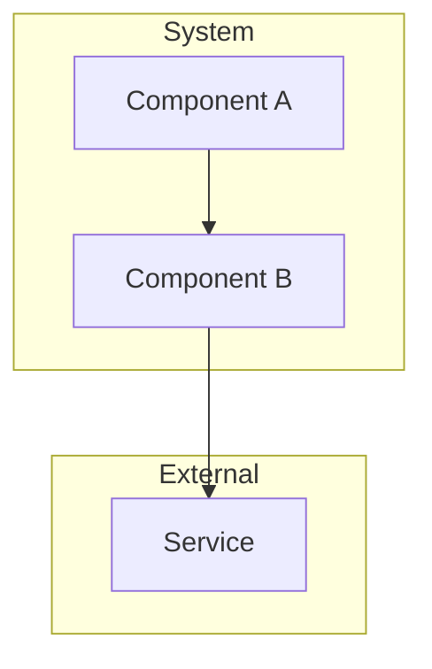

# Mermaid Diagram Guide

Mermaid is a JavaScript-based diagramming and charting tool that uses a simple, markdown-inspired syntax.

## Flowchart

### Basic Syntax

### Node Types

- `[Text]` - Rectangle
- `(Text)` - Rounded rectangle
- `{Text}` - Diamond (decision)
- `([Text])` - Stadium shape
- `[[Text]]` - Subroutine
- `[(Text)]` - Cylinder
- `(( Text ))` - Circle

## Sequence Diagram

## Class Diagram

## State Diagram

## Entity-Relationship Diagram

## Gantt Chart

## Common Patterns

### Decision Flow

### Nested Subgraph

